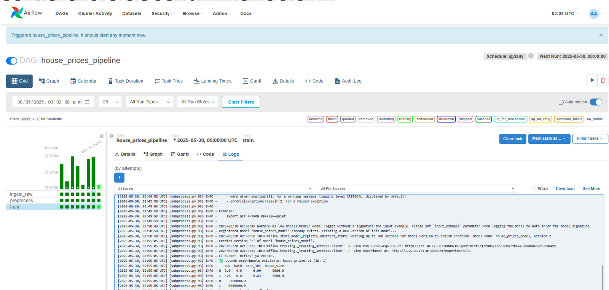
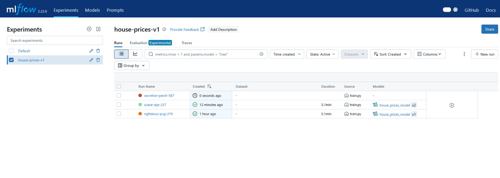
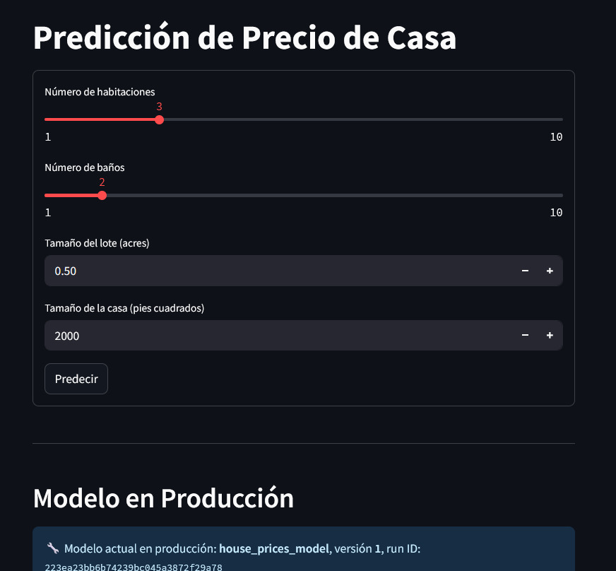
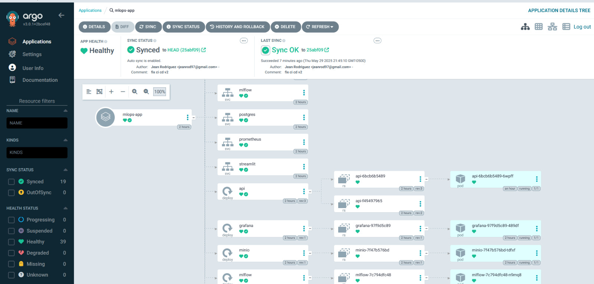
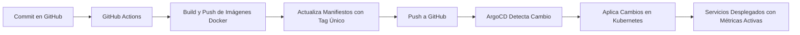
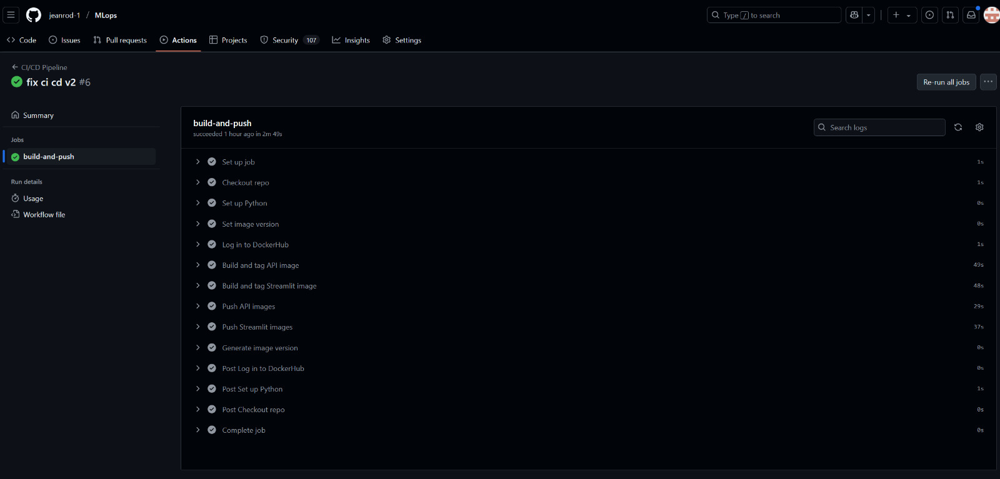

# Guía Completa Proyecto Final

Este documento explica detalladamente cómo construir imágenes Docker, desplegar servicios con Docker, Apache Airflow y Kubernetes (MicroK8s), y cómo monitorear el sistema completo. Además, incluye la integración con CI/CD automatizado y GitOps con ArgoCD para facilitar la gestión continua y la sincronización del clúster.

---

## 1. Construcción y Despliegue Inicial de Imágenes Docker

> Este paso se realiza una sola vez para desplegar los servicios iniciales. Luego, el proceso de build y push se automatiza con GitHub Actions.

### 1.1 Construcción de las Imágenes Docker

```bash
docker build -t jeanrod1/fastapi-api:latest -f api/Dockerfile .
docker build -t jeanrod1/streamlit:latest ./ui
```

### 1.2 Iniciar Sesión en Docker Hub

```bash
docker login
```

### 1.3 Subir las Imágenes a Docker Hub

```bash
docker push jeanrod1/fastapi-api:latest
docker push jeanrod1/streamlit:latest
```

---

## 2. Despliegue de Apache Airflow

### 2.1 Preparar el Entorno y Directorios

```bash
mkdir -p ./dags ./logs ./plugins ./models
echo -e "AIRFLOW_UID=$(id -u)" > .env
```

### 2.2 Inicializar y Levantar Airflow con Docker Compose

```bash
sudo docker-compose -f docker-compose.airflow.yaml up airflow-init
sudo docker-compose -f docker-compose.airflow.yaml up --build
```

### 2.3 Acceder a la Interfaz Web de Airflow

- URL: [http://localhost:8080](http://localhost:8080)
- Credenciales:
  - Usuario: `airflow`
  - Contraseña: `airflow`



### 2.4 Ejecutar los DAGs en Orden

```text
ingest >> preprocess >> train
```

---

## 3. Configuración de Kubernetes con MicroK8s

### 3.1 Habilitar Almacenamiento Persistente

```bash
sudo microk8s enable hostpath-storage
```

### 3.2 Verificar Recursos Desplegados

```bash
sudo microk8s kubectl get all --all-namespaces
```

### 3.3 Crear Namespace para MLOps

```bash
sudo microk8s kubectl create namespace mlops
```

### 3.4 Desplegar Recursos en Kubernetes

```bash
sudo microk8s kubectl apply -n mlops -f install.yaml
sudo microk8s kubectl apply -n mlops -k manifests/
sudo microk8s kubectl apply -n mlops -f argo-cd/app.yaml
sudo microk8s kubectl get pods -n mlops
```

---

## 4. Despliegue de Servicios en Kubernetes

> Usamos servicios de tipo NodePort para exponer los servicios fuera del clúster, facilitando el acceso desde Airflow y otros componentes.

### 4.1 Redireccionar Puertos con Port-Forward (para acceder a ArgoCD)

```bash
sudo microk8s kubectl port-forward svc/argocd-server -n mlops 9090:443
```

### 4.2 Obtener Contraseña Inicial de ArgoCD

```bash
sudo microk8s kubectl -n mlops get secret argocd-initial-admin-secret -o jsonpath="{.data.password}" | base64 -d; echo
```

- Usuario: `admin`
- Contraseña: la que devuelve el comando anterior

---

## 5. Verificación de Servicios

### 5.1 MLflow: Revisar Experimentos y Modelos

- URL: [http://172.30.173.0:30008](http://172.30.173.0:30008)



### 5.2 API: Verificar Estado y Funcionalidad

- URL: [http://172.30.173.0:30012/health](http://172.30.173.0:30012/health)


### 5.3 UI de Streamlit: Probar Interfaz de Usuario

- URL: [http://172.30.173.0:30010](http://172.30.173.0:30010)



### 5.4 Grafana: Revisar Paneles y Funcionalidad

- URL: [http://172.30.173.0:30013](http://172.30.173.0:30013)


### 5.5 Agregar Datasource Prometheus en Grafana

- URL: [http://172.30.173.0:30013](http://172.30.173.0:30013)


### 5.6 Visualizar Dashboards de Prometheus en Grafana

- URL: [http://172.30.173.0:30013](http://172.30.173.0:30013)


---

## 6. ArgoCD: Gestión Declarativa y GitOps

- ArgoCD sincroniza automáticamente el estado del clúster con el repositorio Git.
- Corrige cambios manuales en el clúster que no estén reflejados en Git.
- Aplica automáticamente cambios realizados en Git.
- Eliminar recursos en Git elimina esos recursos en Kubernetes.



---

## 7. CI/CD Automatizado con GitHub Actions

> Cada push a las ramas `Proyecto_Final` o al folder `.github/ci-cd` dispara un pipeline que construye, publica imágenes y actualiza despliegues.

### 7.1 Flujo del Pipeline CI/CD




###
---