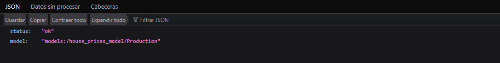

# MLOps Deployment Guide

Este documento explica paso a paso cómo construir imágenes, desplegar servicios usando Docker, Airflow y Kubernetes, y cómo monitorear todo el sistema.

---

## 1. Construcción y despliegue de imágenes Docker

### 1.1 Construir imágenes
```bash
docker build -t jeanrod1/fastapi-api:latest -f api/Dockerfile .
docker build -t jeanrod1/streamlit:latest ./ui
```

### 1.2 Iniciar sesión en Docker Hub
```bash
docker login
```

### 1.3 Subir las imágenes a Docker Hub
```bash
docker push jeanrod1/fastapi-api:latest
docker push jeanrod1/streamlit:latest
```

---

## 2. Desplegar Apache Airflow

### 2.1 Preparar entorno de directorios
```bash
mkdir -p ./dags ./logs ./plugins
echo -e "AIRFLOW_UID=$(id -u)" > .env
mkdir -p ./models
```

### 2.2 Inicializar y levantar Airflow
```bash
sudo docker-compose -f docker-compose.airflow.yaml up airflow-init 
sudo docker-compose -f docker-compose.airflow.yaml up --build
```

### 2.3 Ir a la interfaz de Airflow
Navegar a: [http://localhost:8080](http://localhost:8080)  
Loguearse con:
- **Usuario**: `airflow`
- **Contraseña**: `airflow`


### 2.4 Ejecutar los DAGs
Ejecutar en el siguiente orden:
```
ingest >> preprocess >> train >> select_best
```

---

## 3. Configurar Kubernetes (microk8s)


### 3.2 Habilitar almacenamiento
```bash
sudo microk8s enable hostpath-storage

```

### 3.3 Revisar todos los recursos desplegados
```bash
sudo microk8s kubectl get all --all-namespaces
```

### 3.4 Crear namespace para MLOps
```bash
sudo microk8s kubectl create namespace mlops
```

sudo microk8s kubectl apply -n mlops -f install.yaml
sudo microk8s kubectl apply -n mlops -k manifests/
sudo microk8s kubectl apply -n mlops -f argo-cd/app.yaml
sudo microk8s kubectl get pods -n mlops

---

## 4. Despliegue de servicios en Kubernetes

> Hicimos NodePort para habilitar los servicios fuera del clúster de Kubernetes y que Airflow pueda acceder a ellos.
sudo microk8s kubectl port-forward svc/argocd-server -n mlops 9090:443

---

### c. Obtener contraseña de ArgoCD

```bash
sudo microk8s kubectl -n mlops get secret argocd-initial-admin-secret -o jsonpath="{.data.password}" | base64 -d; echo
```
admin
pass

## 5. Verificación de Servicios

### 5.1 Ir a MLflow y revisar los experimentos y modelos registrados  
[http://172.30.173.0:30008](http://172.30.173.0:30008)  


### 5.2 Ir a la API y revisar que funcione correctamente  
[http://172.30.173.0:30012](http://172.30.173.0:30012/health)  


### 5.3 Ir a la UI de Streamlit, revisar que funcione correctamente y probarla  
[http://172.30.173.0:30010](http://172.30.173.0:30010)  


### 5.4 Ir a la UI de Grafana, revisar que funcione correctamente y probarla  
[http://172.30.173.0:30013](http://172.30.173.0:30013)  


### 5.5 Agregar el datasource de Prometheus en Grafana  
[http://172.30.173.0:30013](http://172.30.173.0:30013)  


### 5.6 Revisar dashboards que proporciona Prometheus desde Grafana  
[http://172.30.173.0:30013](http://172.30.173.0:30013)  


## ✅ Conclusiones

- Todos los servicios fueron integrados exitosamente: Airflow, MLflow, API, UI, Monitoreo y Pruebas de carga.
- Se utilizó `NodePort` para facilitar la conexión entre Airflow y los servicios externos al cluster.
- El sistema soporta hasta **8,000 usuarios concurrentes** con buena estabilidad, ideal para pruebas en producción.
