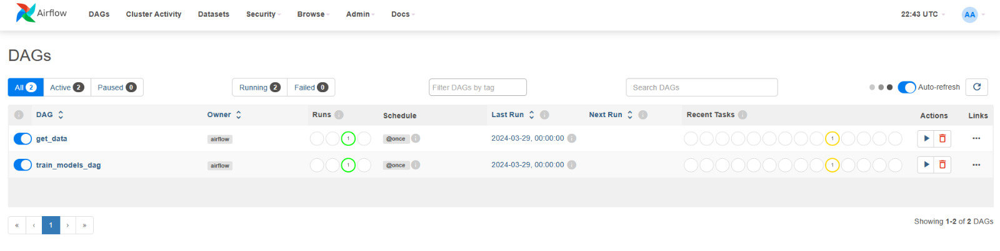
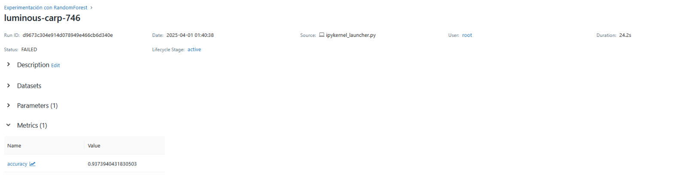
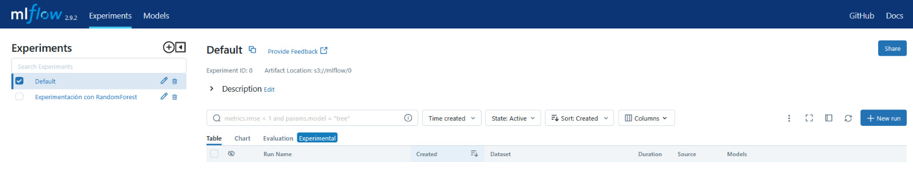
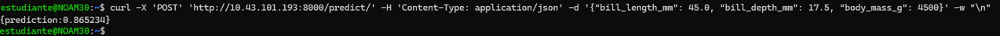

## Instrucciones para Ejecutar

1. **Crear directorios y variables para la ejecución:**

   ```bash
   mkdir -p ./dags ./logs ./plugins
   echo -e "AIRFLOW_UID=$(id -u)" > .env

2. **Crear directorio para guardar los modelos:**

   ```bash
   mkdir -p ./models

3. **Reconstrucción de imágenes y instanciamiento de contenedores:**

   ```bash
   docker compose up airflow-init
   docker-compose up --build


4. **Ir a Airflow y ejecutar los DAG para traer los datos y entrenar los modelos (http://10.43.101.193:8080):**

   ```bash
   usuario: airflow
   contraseña: airflow



5. **Verificar los servicios donde quedaron registrados los experimentos y artefactos:**
   ```bash
   MLflow: http://10.43.101.193:5000
   MinIO: http://10.43.101.193:9090





4. **Probar la API:**

    ```bash
   curl -X 'GET' 'http://10.43.101.193:8000/predict?bill_length_mm=45.0&bill_depth_mm=17.5&body_mass_g=4500'



