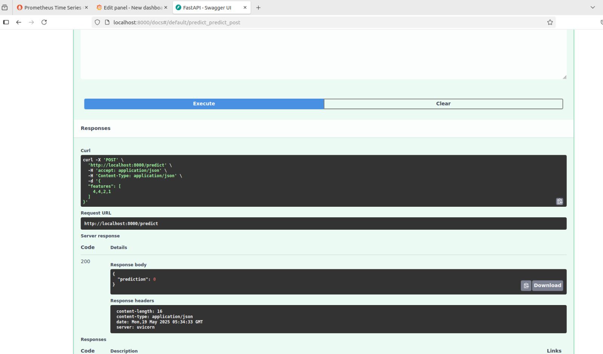
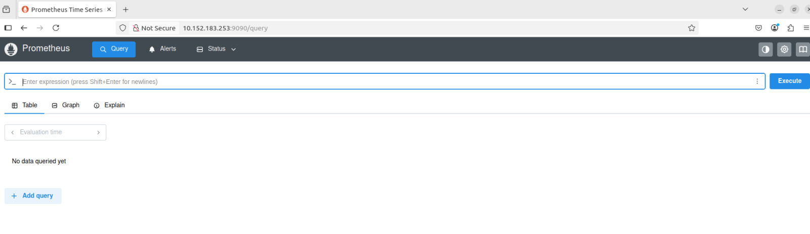
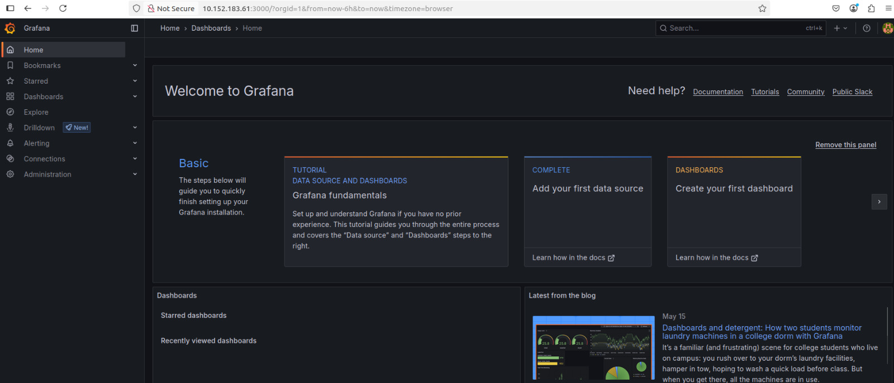
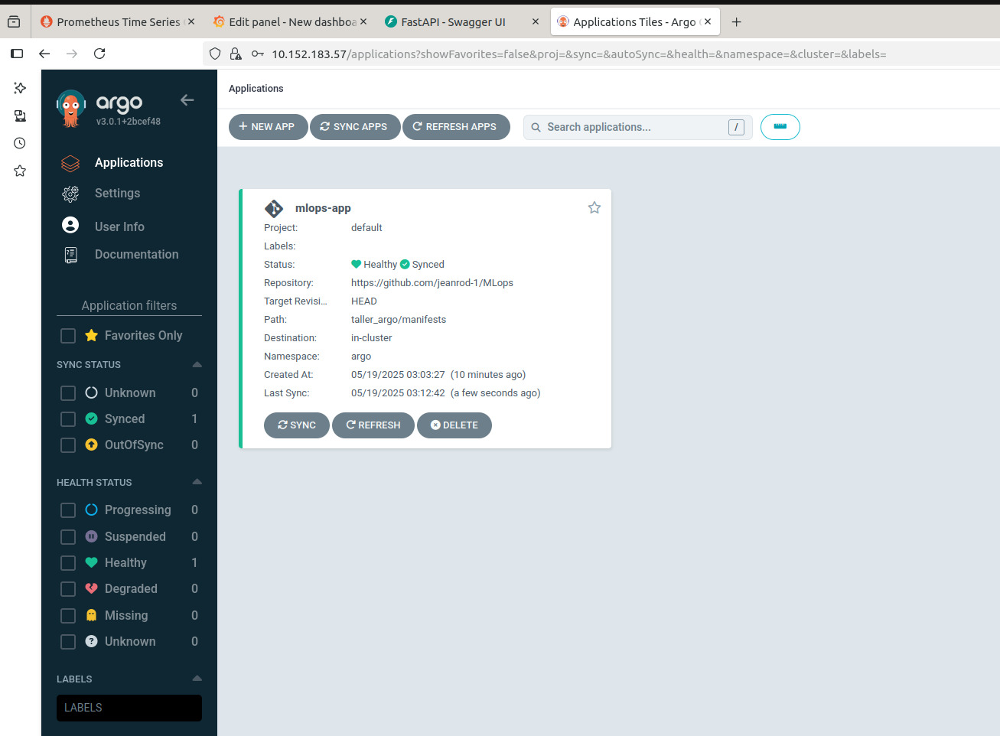
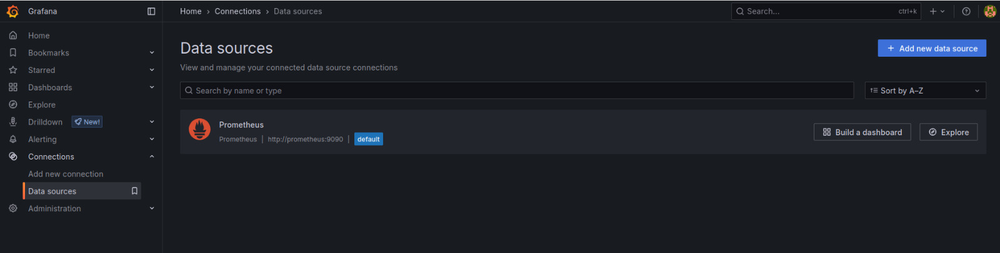
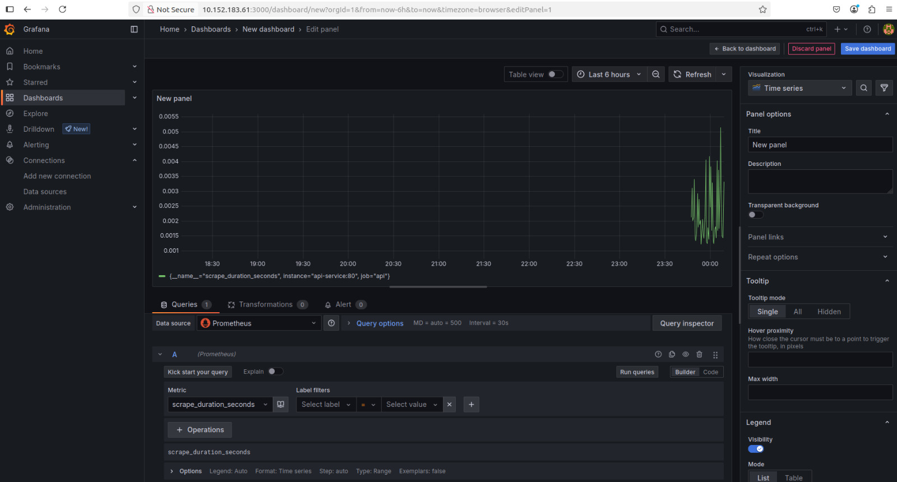
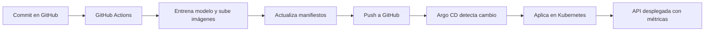
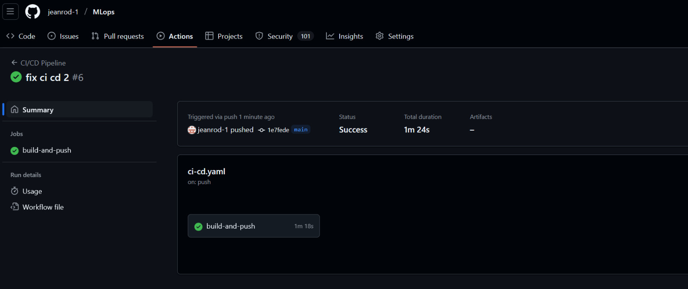

# Despliegue con FastAPI + Kubernetes + ArgoCD + CI/CD

En este taller desplegamos una API hecha en FastAPI dentro de un clúster de Kubernetes, usando ArgoCD para GitOps y GitHub Actions para CI/CD. También incluye monitoreo con Prometheus y Grafana.

---

## 📦 1. Construcción y Publicación de Imágenes Docker

### ✅ API (FastAPI)

```bash
cd api
docker build -t jeanrod1/fastapi-api:latest .
docker push jeanrod1/fastapi-api:latest
```

### ✅ Load Tester

```bash
cd loadtester
docker build -t jeanrod1/loadtester:latest .
docker push jeanrod1/loadtester:latest
```

---

## 📂 2. Crear Namespace en Kubernetes

```bash
sudo microk8s kubectl create namespace argo
```

---

## 📥 3. Instalar ArgoCD en el Cluster

```bash
sudo microk8s kubectl apply -n argo -f https://raw.githubusercontent.com/argoproj/argo-cd/stable/manifests/install.yaml
```

(O con archivo local)

```bash
sudo microk8s kubectl apply -n argo -f install.yaml
```

---

## 📄 4. Aplicar Manifiestos del Proyecto

```bash
sudo microk8s kubectl apply -n argo -k manifests/
sudo microk8s kubectl get pods -n argo
```

---

## ⚙️ 5. Configurar Aplicación en ArgoCD

### a. Crear la aplicación (una sola vez)

```bash
sudo microk8s kubectl apply -n argo -f argo-cd/app.yaml
```

### b. ¿Qué hace ArgoCD?

- Detecta cambios en el repositorio Git
- Aplica automáticamente los manifiestos
- Mantiene el estado deseado en Kubernetes

---

## 🌐 6. Acceder a los Servicios

### a. Redireccionar puertos con port-forward

```bash
sudo microk8s kubectl port-forward svc/api-service 8000:80 -n argo
```

### b. Direcciones de los Servicios

| Servicio    | URL de acceso                       | IP de ejemplo        |
|-------------|--------------------------------------|-----------------------|
| **FastAPI** | `http://<CLUSTER_IP>:8080/predict`  | `10.152.183.224`      |
| **Prometheus** | `http://<CLUSTER_IP>:9090`       | `10.152.183.253`      |
| **Grafana**    | `http://<CLUSTER_IP>:3000`       | `10.152.183.61`       |
| **ArgoCD**     | `http://<CLUSTER_IP>:80`         | `10.152.183.127`      |

### c. Obtener contraseña de ArgoCD

```bash
sudo microk8s kubectl -n argo get secret argocd-initial-admin-secret -o jsonpath="{.data.password}" | base64 -d; echo
```

Credenciales por defecto:
- Usuario: `admin`
- Contraseña: la que obtuviste con el comando anterior

### d. Servicios desplegados

#### FastAPI


#### Prometheus


#### Grafana


#### ArgoCD


---

## 📊 7. Visualizar Métricas en Grafana

### a. Entrar a Grafana

- URL: `http://<CLUSTER_IP>:3000`
- Usuario/contraseña por defecto: `admin / admin`

### b. Configurar Prometheus como data source

1. Añadir Prometheus como fuente de datos:
   

2. Crear dashboards con métricas como:
   - `http_requests_total`
   - `response_latency_seconds`

   

---

## 🤖 8. CI/CD Automatizado con GitHub Actions

Cada vez que haces `git push`, se ejecuta un flujo automático de despliegue continuo.

### Diagrama del flujo CI/CD





---

## 🔁 9. GitOps: Sincronización Automática con ArgoCD

ArgoCD monitorea la carpeta `taller_argo/manifests` de tu repositorio y asegura que el estado del clúster esté **siempre sincronizado** con Git:

- Si alguien cambia el clúster manualmente, Argo lo **corrige automáticamente**.
- Si borras algo del repositorio, **se borra del clúster**.
- Si haces un cambio en Git, **se aplica automáticamente**.

---