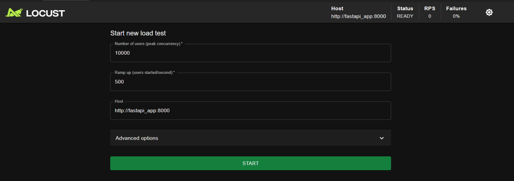
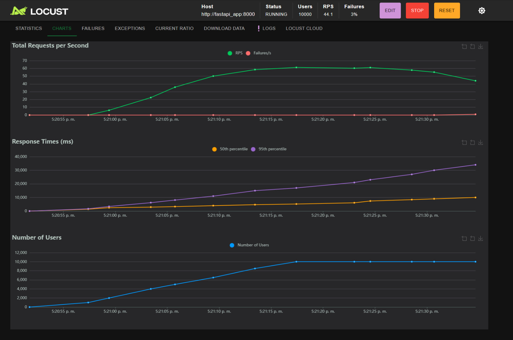
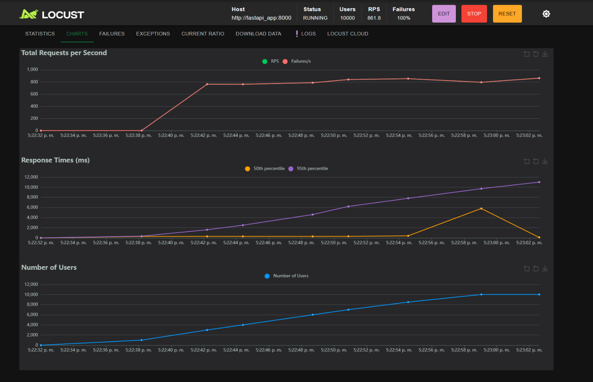
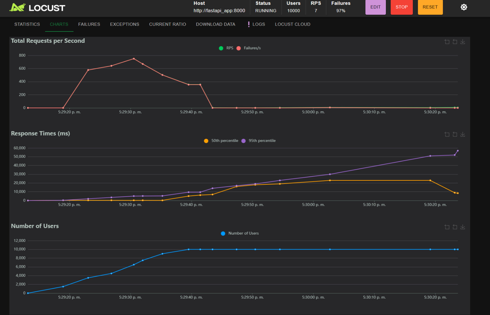
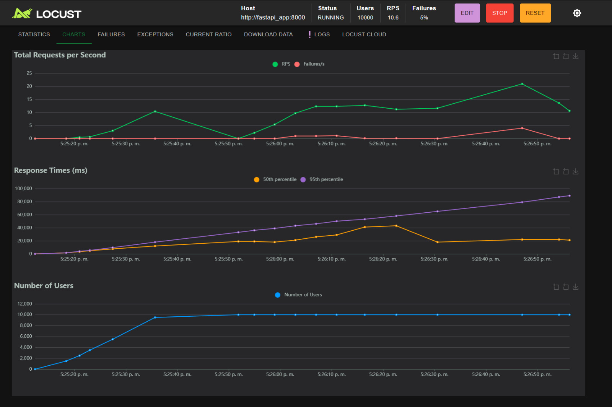
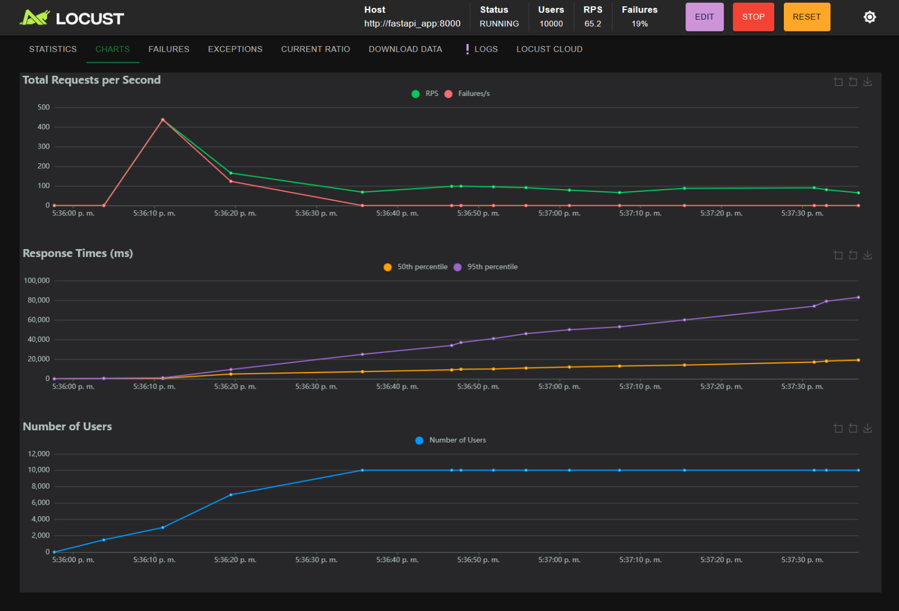
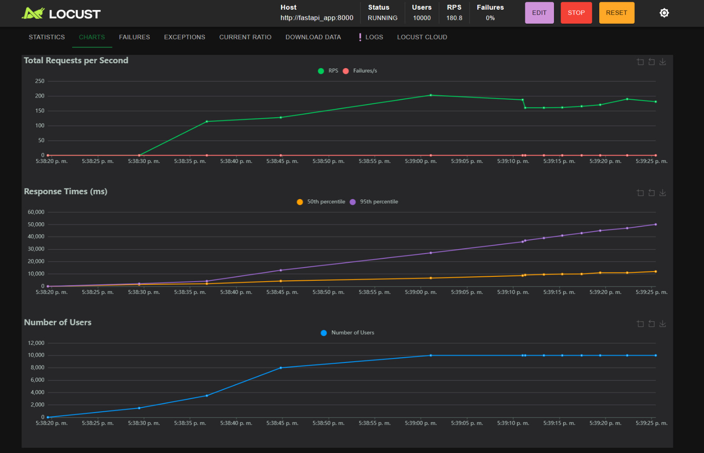

## Instrucciones para Ejecutar

1. **Construir la imagen agregando el tag (user/image-name:tag):**

   ```bash
   docker build -t jeanrod1/api-inference:latest .

2. **Hacer login en Docker Hub:**

   ```bash
   docker login

3. **Pushear la imagen construida en la nube:**

   ```bash
   docker push jeanrod1/api-inference:latest


4. **Probar la imagen construida:**

   ```bash
   docker compose -f docker-compose.yaml up

   curl -X POST "http://localhost:8000/predict" \
     -H "Content-Type: application/json" \
     -d '{"sepal_length": 5.1, "sepal_width": 3.5, "petal_length": 1.4, "petal_width": 0.2}'

---

### 5. Ejecutar pruebas de carga con Locust

Levanta el entorno de Locust para hacer pruebas de estrés:

```bash
docker-compose -f docker-compose.locust.yaml up
```

---

## 📊 Resultados de Pruebas con Locust

### Interfaz Locust



---

### 🔁 Iterando Recursos (sin réplicas)

| CPUs     | Memoria   | Resultado        | Imagen                                                                 |
|----------|-----------|------------------|------------------------------------------------------------------------|
| 2        | 1000M     | ✅ Corre perfecto |                      |
| 0.25     | 128M      | ❌ Se cae todo    |                  |
| 0.35     | 192M      | ❌ Se cae todo    |                  |
| 0.5      | 250M      | ⚠️ Apenas pasa    |                 |

---

### ➕ Agregando Réplicas

| Réplicas | CPUs por réplica | Memoria por réplica | Resultado          | Imagen                                                                 |
|----------|------------------|----------------------|--------------------|------------------------------------------------------------------------|
| 3        | 0.5              | 250M                 | ❌ Se cae todo      |                     |
| 3        | 1.0              | 500M                 | ⚠️ Aún insuficiente |                    |
| 3        | 2.0              | 1000M                | ✅ Funciona bien     |                       |


### Conclusiones
- Si bien puede resultar contraintuitivo, la incorporación de recursos adicionales a través de réplicas resulta fundamental para asegurar el adecuado desempeño del sistema.
  
- Incluso duplicando los recursos mínimos requeridos en ausencia de réplicas, la configuración con 3 réplicas continúa siendo insuficiente para satisfacer la demanda.
